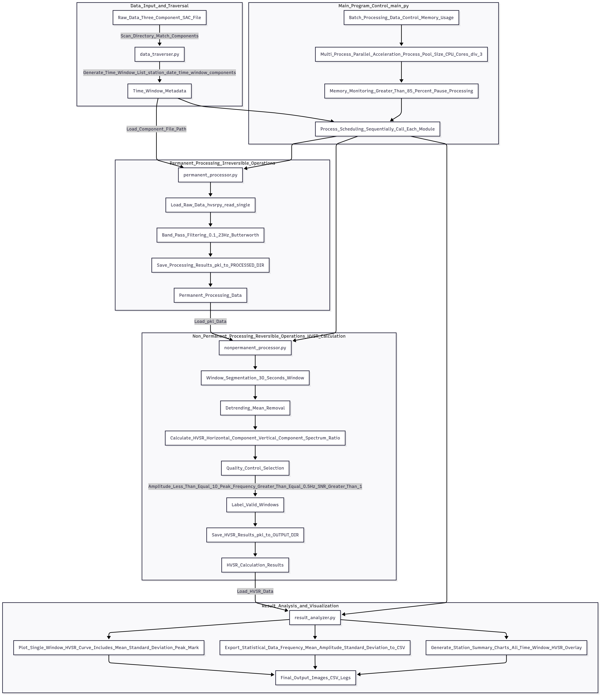
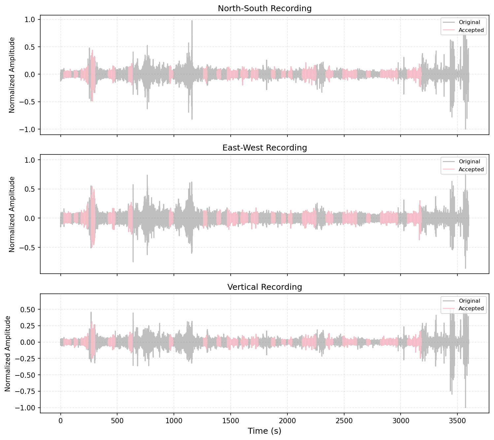
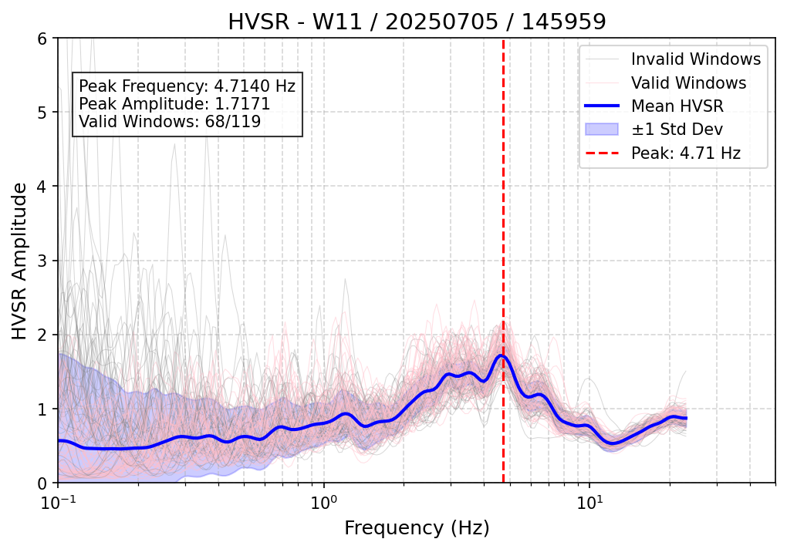
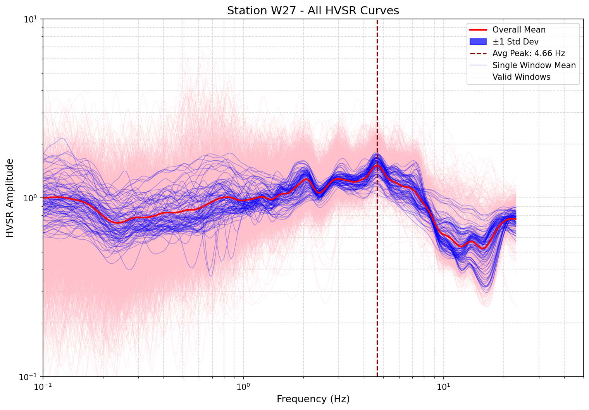

# HVSeismic Tool：基于hvsrpy的地震数据HVSR分析工具
基于hvsrpy的地震数据处理工具，适用于水平垂直谱比（HVSR）分析，支持批量处理、质量控制与多维度可视化。

<div align="center">
  
  <br>
  <div style="margin: 10px 0; gap: 8px; display: inline-flex;">
    
    
    
  </div>
</div>


## 作者信息
- **姓名**：jocelyn  
  


## 版权声明
### 1. 核心依赖版权
本项目基于 **hvsrpy v2.0.0** 开发，其版权归属如下：  
- 开发者：Joseph P. Vantassel（Virginia Tech）及贡献者  
- 许可证：GNU General Public License v3.0（GPLv3）  
- 官方仓库：[jpvantassel/hvsrpy](https://github.com/jpvantassel/hvsrpy)  

### 2. 本项目版权
© 2024 jocelyn，基于GPLv3协议开源。


## 核心功能
- **自动化数据处理**：递归识别台站目录结构，批量处理SAC格式三分量数据，无需手动逐个文件操作。  
- **双模式处理架构**：  
  - 永久性处理：固定执行滤波（0.1-23Hz带通）、去趋势、去均值操作，结果可复用。  
  - 非永久性处理：可配置窗口分割时长、HVSR计算、质量筛选，参数调整灵活。  
- **专业级HVSR计算**：采用Konno-Ohmachi平滑算法（带宽系数40），水平分量（BNN+BNE）取几何平均，符合行业标准。  
- **多维度质量控制**：基于信噪比（SNR）、波形完整性、频谱特征进行自动筛选，剔除无效数据。  
- **Publication级可视化**：支持10+种图表输出，包括单窗口HVSR曲线、三分量波形图、多日结果对比图、台站统计汇总图等，默认150dpi分辨率。  


## 处理流程图
<div align="center">
  
  <p style="color: #666; font-size: 0.9em; margin-top: 10px;">图1：HVSeismic Tool完整处理流程</p>
</div>


## 处理过程图解
### 1. 窗口分割与质量控制
<div align="center">
  
  <p style="color: #666; font-size: 0.9em; margin-top: 10px;">图2：窗口分割与三分量质量控制图（灰色标注无效窗口，粉色标注有效窗口）</p>
</div>

### 2. HVSR计算结果
<div align="center">
  
  <p style="color: #666; font-size: 0.9em; margin-top: 10px;">图3：单时段HVSR计算结果 </p>
</div>

### 3. 台站HVSR曲线统计
<div align="center">
  
  <p style="color: #666; font-size: 0.9em; margin-top: 10px;">图4：单台站（W27）多时段HVSR曲线统计 </p>
</div>


## 📂 项目结构
```bash
hvseismic-tool/
├── main.py                  # 程序入口（协调各模块执行流程，一键启动处理）
├── config.py                # 全局参数配置（路径、处理参数、台站列表等，核心配置文件）
├── data_traverser.py        # 数据路径管理（递归识别台站/日期/时间窗口目录结构）
├── permanent_processor.py   # 永久性处理模块（滤波、去趋势、去均值，结果持久化）
├── nonpermanent_processor.py # 非永久性处理模块（窗口分割、HVSR计算、质量筛选）
├── result_analyzer.py       # 结果分析与可视化模块（图表生成、峰值统计、日志记录）
├── logs/                    # 自动生成的处理日志（按日期命名，记录异常与关键参数）
└── images/                  # 文档示意图目录（流程图、处理过程图等，非程序运行必需）
```


## ⚙️ 环境要求
### 1. 基础环境
- **Python版本**：3.8及以上（推荐3.9版本，兼容性最佳，避免3.10+版本的依赖冲突）  
- **依赖库安装**：通过`pip`安装以下指定版本依赖（版本不匹配可能导致功能异常）：  
  ```bash
  # 核心依赖（HVSR计算与数据处理核心）
  pip install hvsrpy==2.0.0 numpy==1.24.3 scipy==1.10.1
  
  # 辅助依赖（可视化、进度显示、数据处理）
  pip install matplotlib==3.7.1 pandas==1.5.3 tqdm==4.65.0 psutil==5.9.5
  ```

### 2. 输入数据规范
- **格式要求**：必须为SAC格式三分量地震数据（缺一不可）  
- **分量标识**：  
  - BNN：北南方向水平分量  
  - BNE：东西方向水平分量  
  - BNZ：垂直分量  
- **目录结构（严格遵循，否则无法识别数据）**：  
  ```bash
  BASE_DIR/                # 数据根目录（需在config.py中配置）
  ├─ 台站ID/（如W27、W13，自定义命名）
  │  ├─ 日期/（格式YYYYMMDD，如20230101代表2023年1月1日）
  │  │  └─ 时间窗口/（格式HHMMSS，如000000代表0点0分0秒）
  │  │     ├─ W27.BNN.20230101.000000.SAC  # 北南分量
  │  │     ├─ W27.BNE.20230101.000000.SAC  # 东西分量
  │  │     └─ W27.BNZ.20230101.000000.SAC  # 垂直分量
  ```


## 快速使用指南
### 1. 配置参数
修改`config.py`文件，设置核心路径与处理参数（示例如下，根据实际需求调整）：  
```python
# 路径配置（必填：根据本地数据存储位置修改）
BASE_DIR = "D:/SeismicData"       # 原始SAC数据根目录
PROCESSED_DIR = "D:/ProcessedData" # 永久性处理结果保存目录
OUTPUT_DIR = "D:/HVSR_Results"     # 最终HVSR结果（含图表）输出目录

# 处理参数（可按需调整）
SELECTED_STATIONS = ["W27", "W13"] # 待处理台站列表（留空则处理BASE_DIR下所有台站）
WINDOW_LENGTH = 30                 # 窗口分割时长（单位：秒，推荐20-60秒）
FILTER_FREQ = (0.1, 23)            # 带通滤波频率范围（单位：Hz，默认无需修改）
SNR_THRESHOLD = 3.0                # 信噪比阈值（低于此值的窗口将被剔除，默认3.0 dB）
```

### 2. 运行程序
打开终端，进入项目根目录，执行以下命令启动处理：  
```bash
# 进入项目目录（示例路径，需替换为本地项目路径）
cd D:/Projects/hvseismic-tool

# 启动数据处理（需确保已安装所有依赖）
python main.py
```
运行过程中，终端会通过`tqdm`显示进度条（如“处理W27台站：50%|█████     |”），便于掌握进度。

### 3. 查看结果
处理完成后，结果按以下目录结构自动组织，路径对应`config.py`中的配置：

#### （1）永久性处理结果（`PROCESSED_DIR`）
```bash
PROCESSED_DATA/
└── W13/                  # 台站ID（与输入目录一致）
    └── 20250701/         # 日期（与输入目录一致）
        ├── 080000_permanent.pkl  # 永久性处理结果（二进制，可复用）
        │                         # 内容：滤波后三分量数据、采样率、处理时间戳
        └── logs/                # 处理日志目录
            └── 080000.log       # 日志文件：记录滤波参数、数据长度、是否有异常
```

#### （2）最终HVSR结果（`OUTPUT_DIR`）
```bash
HVSR_RESULT/
├── W13/                  # 台站ID
│   └── 20250701/         # 日期
│       ├── 080000_hvsr.pkl      # HVSR计算结果（二进制）
│       │                         # 内容：各窗口HVSR振幅、频率、有效窗口掩码
│       ├── 080000_peaks.txt     # 峰值信息（文本文件，可直接打开）
│       │                         # 内容示例：
│       │                         # Peak Frequency (Hz): 1.2500
│       │                         # Peak Amplitude: 2.3400
│       │                         # Valid Windows: 15/20  # 有效窗口数/总窗口数
│       │                         # Mean SNR: 3.50 dB     # 平均信噪比
│       └── logs/                # 非永久性处理日志
│           └── 080000.log       # 记录窗口分割、质量筛选参数、计算耗时
│
├── plots/                # 可视化图表目录（按台站-日期分类）
│   └── W13/
│       ├── 20250701/
│       │   ├── 080000_hvsr.png  # 单窗口HVSR曲线图（Publication级）
│       │   └── 080000_3c.png    # 三分量波形图（BNN/BNE/BNZ对比）
│       └── W13_all_hvsr.png     # 台站所有时间窗口HVSR汇总图
│
└── summary/              # 结构化统计数据目录
    └── W13_summary.csv   # 台站统计表格（含每日峰值频率、振幅、有效窗口占比）
```


## 注意事项
1. **测试建议**：首次处理大型数据集（如超过10个台站/100个时间窗口）时，建议先通过`SELECTED_STATIONS`指定1-2个台站测试，确认参数配置正确后再批量运行。  
2. **结果复用**：永久性处理结果（`*.pkl`）会保存在`PROCESSED_DIR`，再次运行时若路径不变，程序会自动复用已处理数据，无需重复滤波，节省时间。  
3. **图表分辨率**：所有输出图表默认300dpi，若需调整，可修改`result_analyzer.py`中的`dpi`参数（支持100-600dpi）。  
4. **问题排查**：若处理中断或结果异常，优先查看对应目录下的`logs/`日志文件，日志会详细记录错误位置（如“某时间窗口数据长度不足”）。  
5. **数据兼容性**：仅支持标准SAC格式（含必要头段，如`delta`采样率、`npts`数据点数），非标准SAC文件需先通过SAC工具预处理。  


## 📩 联系作者
这是我的第一个项目，还有很多不足后续会继续优化，但是可以支持多台站的hvsr分析，如有问题讨论，请联系我！：  
- 邮箱1：[pengxw8@mail2.sysu.edu.cn](mailto:pengxw8@mail2.sysu.edu.cn)  
- 邮箱2：[2663546035@qq.com](mailto:2663546035@qq.com)
